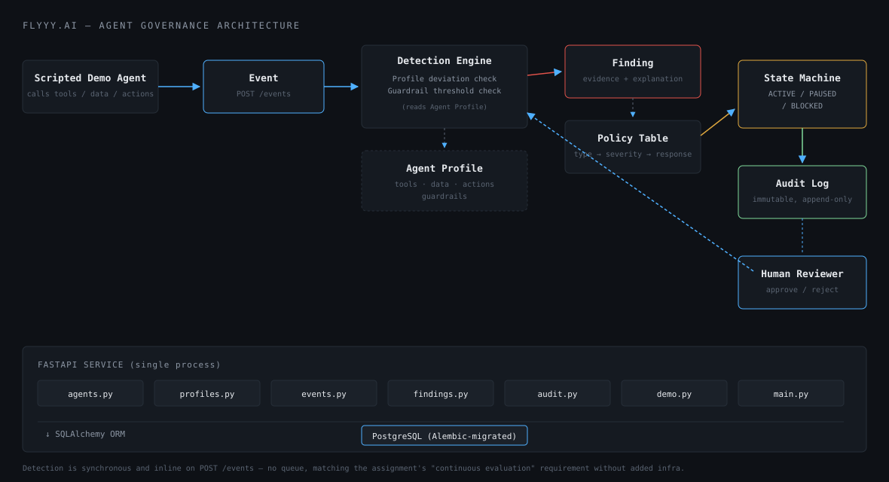
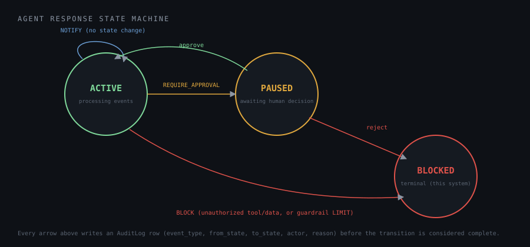

#  Agent Governance

A system that defines what an AI agent is allowed to do, watches what it actually does, detects deviations with evidence, and responds proportionally — with every decision recorded in an auditable trail.

## Problem

AI agents are increasingly given tools, data access, and the ability to take action on their own. Once deployed, most teams have no continuous way to answer: *is this agent still doing what it's supposed to?* A static allow-list check at call time isn't enough — it doesn't explain itself, doesn't distinguish a minor overage from a serious violation, and gives a human no way to intervene before something goes wrong.

This project builds that missing layer: a governance service that sits between an agent's actions and the outside world, and that a founder, auditor, or engineer can actually trust because every decision is explainable and recorded.

## Why governance, not just access control

A binary `if tool not in allowed_tools: block()` check is a linter, not governance. Real governance needs:
- **Evidence**, not just a rejection — what was expected, what happened, why it's a deviation
- **Graduated response** — a warning at 80% of a limit is not the same as blowing past it
- **A human in the loop** for ambiguous cases, not just automatic block/allow
- **An immutable record** of what happened and who decided what

Those four requirements shaped every design decision below.

## Architecture



One FastAPI service, one PostgreSQL database, no queues or extra infrastructure. Detection runs **synchronously inline** on event ingestion — the assignment calls for continuous evaluation, and a message queue would add operational complexity without making the governance logic itself any more correct at this scale.

```
Scripted Demo Agent → Event → Detection Engine → Finding → Policy Table → State Machine → Audit Log
                                     ↑                                         ↓
                                Agent Profile                          Human Reviewer (approve/reject)
```

**Why a scripted demo agent instead of a framework (LangGraph/LangChain):** the agent's own reasoning isn't what's being evaluated here — the governance layer is. A framework would add dependency weight without making detection or response any more demonstrable, so `demo_agent.py` is a small set of plain Python functions that emit realistic tool/data/action calls.

## Governance model

Three things define what an agent is allowed to do, all attached to an `AgentProfile`:

| Concept | What it constrains |
|---|---|
| **Allowed tools** | Which functions/tools the agent may call |
| **Allowed data sources** | Which data the agent may access |
| **Allowed actions** | Which operations the agent may perform |
| **Guardrails** | Numeric usage limits (e.g. calls per run) with warning/critical/limit thresholds |

Only one profile is active per agent at a time. Editing a profile doesn't retroactively change past findings — it changes what's checked going forward.

## Detection flow

Every event ingested via `POST /events` runs through two independent detectors (`app/detection.py`):

1. **Profile deviation detector** — checks the event's `tool_used`, `data_source_used`, and `action` against the active profile's allow-lists. Any value not present produces a `Finding` (`UNAUTHORIZED_TOOL`, `UNAUTHORIZED_DATA`, or `UNAUTHORIZED_ACTION`).
2. **Guardrail threshold detector** — counts events for the current `run_id` against each configured guardrail's `max_value` and checks whether a new threshold has been crossed.

Both write structured, deterministic `Finding` rows — never an LLM-generated explanation. Every finding answers: which agent, which run, which event, what was expected, what actually happened, why it's a deviation, what severity, what response, and when.

Example (real output from a live run — see [Evaluation](#evaluation-scenarios) below):

> *"Agent attempted to use 'file_delete', which is not included in its active profile."*

## Warning zones (guardrails)

Guardrails are configurable per profile, not hardcoded:

```
max_calls = 10
warning_threshold  = 80%
critical_threshold = 90%
limit_threshold    = 100%
```

**Threshold-crossing, not threshold-checking:** each level fires exactly once per guardrail per run, tracked via `Guardrail.last_warning_level`. Without this, a long run sitting at 95% would re-emit `GUARDRAIL_WARNING` and `GUARDRAIL_CRITICAL` findings on every subsequent event. Verified behavior from a real 10-call run:

| Call # | Usage | Finding | Severity | Response |
|---|---|---|---|---|
| 8 | 80% | `GUARDRAIL_WARNING` | LOW | NOTIFY |
| 9 | 90% | `GUARDRAIL_CRITICAL` | MEDIUM | REQUIRE_APPROVAL |
| 10 | 100% | `GUARDRAIL_LIMIT` | HIGH | BLOCK |

Each level fired exactly once — calls 1–7 produced nothing, and no level repeated on subsequent calls.

## Severity → response policy

A small, explicit, deterministic lookup table (`app/policy.py`) — no ML, no LLM classification:

| Finding type | Severity | Response |
|---|---|---|
| `UNAUTHORIZED_TOOL` | HIGH | BLOCK |
| `UNAUTHORIZED_DATA` | HIGH | BLOCK |
| `UNAUTHORIZED_ACTION` | MEDIUM | REQUIRE_APPROVAL |
| `GUARDRAIL_WARNING` | LOW | NOTIFY |
| `GUARDRAIL_CRITICAL` | MEDIUM | REQUIRE_APPROVAL |
| `GUARDRAIL_LIMIT` | HIGH | BLOCK |

Any "why did this happen?" question is answerable by pointing at this one table.

## Agent state machine



```
ACTIVE ──(NOTIFY)───────────────────► ACTIVE      (no state change)
ACTIVE ──(REQUIRE_APPROVAL)─────────► PAUSED
ACTIVE ──(BLOCK)─────────────────────► BLOCKED
PAUSED ──(approve)───────────────────► ACTIVE
PAUSED ──(reject)────────────────────► BLOCKED
BLOCKED — terminal in this system (see Limitations)
```

All transitions live in one place (`app/state_machine.py`) — `agent.state` is never mutated anywhere else in the codebase. A `PAUSED` or `BLOCKED` agent is rejected (`409`) by the event-ingestion endpoint until a human resolves the pending finding.

## Auditability

Every state transition and every finding writes an `AuditLog` row: `event_type`, `from_state`, `to_state`, `actor` ("system" or the approver's identity), `reason`, timestamp. The log is append-only — nothing is ever updated or deleted.

Real audit trail captured from a live PostgreSQL run (Scenario D, abbreviated):

```
FINDING_CREATED    ACTIVE → ACTIVE    actor=system              "Agent performed action 'update_profile'..."
STATE_CHANGED       ACTIVE → PAUSED    actor=system              "Approval required: ..."
APPROVAL_REQUESTED  PAUSED → PAUSED    actor=system              "Agent performed action 'update_profile'..."
APPROVED             PAUSED → ACTIVE   actor=reviewer@flyyy.ai   "confirmed legitimate"
STATE_CHANGED        PAUSED → ACTIVE   actor=reviewer@flyyy.ai   "Resumed after approval by reviewer@flyyy.ai"
```

## Evaluation scenarios

Four reproducible scenarios, each provisioning a fresh agent and replaying scripted calls through the real ingestion/detection/response pipeline — not mocked.

| Scenario | What it exercises | Verified result |
|---|---|---|
| **A — Normal behavior** | All calls within the approved profile | 0 findings, agent stays `ACTIVE` |
| **B — Unauthorized tool** | Agent calls `file_delete`, outside its profile | `UNAUTHORIZED_TOOL` finding (HIGH), agent → `BLOCKED` |
| **C — Guardrail escalation** | 10 calls against a `max_value=10` guardrail | WARNING at call 8, CRITICAL (auto-approved) at call 9, LIMIT at call 10 → `BLOCKED` |
| **D — Human approval** | Agent performs an unapproved action | `UNAUTHORIZED_ACTION` finding (MEDIUM) → `PAUSED`; approve endpoint resumes to `ACTIVE`, full audit trail recorded |

Run them yourself:
```bash
curl -X POST http://localhost:8000/demo/run-scenario/A
curl -X POST http://localhost:8000/demo/run-scenario/B
curl -X POST http://localhost:8000/demo/run-scenario/C
curl -X POST http://localhost:8000/demo/run-scenario/D
```
Full sample output from an actual run is saved at `backend/tests/sample_scenario_output.json`.

### Verified test results

**9/9 tests pass**, run against both SQLite (zero-setup default) and real PostgreSQL (matching the Docker Compose target):

```
tests/test_detection.py::test_normal_run_produces_no_findings PASSED
tests/test_detection.py::test_unauthorized_tool_blocks_agent PASSED
tests/test_detection.py::test_unauthorized_action_pauses_agent_for_approval PASSED
tests/test_detection.py::test_reject_blocks_agent PASSED
tests/test_guardrails.py::test_guardrail_thresholds_fire_once_each PASSED
tests/test_scenarios.py::test_scenario_a_normal_behavior_no_findings PASSED
tests/test_scenarios.py::test_scenario_b_unauthorized_tool_blocks PASSED
tests/test_scenarios.py::test_scenario_c_guardrail_escalation PASSED
tests/test_scenarios.py::test_scenario_d_human_approval_pauses_and_awaits_decision PASSED
======================== 9 passed in 0.4–0.5s ========================
```

This was verified twice: once with `DATABASE_URL` unset (SQLite fallback) and once with `DATABASE_URL` pointed at a real local PostgreSQL 16 instance after running `alembic upgrade head` against it. Both runs passed identically. The live server was also started against that same PostgreSQL instance and driven over real HTTP (`curl`) through all four scenarios plus the full approve/audit flow, confirming the API, detection, state machine, and audit logging all work end-to-end against the actual target database — not just in-process tests.

## Local setup (no Docker)

```bash
cd backend
pip install -r requirements.txt --break-system-packages   # or use a venv
uvicorn app.main:app --reload
# Runs on http://localhost:8000, defaults to a local SQLite file if
# DATABASE_URL is unset. Tables are created automatically on startup.
```

```bash
cd frontend
npm install
npm run dev
# Runs on http://localhost:5173
```

## Docker Compose (PostgreSQL)

```bash
docker compose up --build
```
This starts PostgreSQL, runs `alembic upgrade head`, and starts both the API (`:8000`) and the console (`:5173`).

## Demo instructions

1. Start the stack (Docker Compose or local, above).
2. Open the console at `http://localhost:5173`.
3. Click a scenario button (A–D) to provision an agent and run it live.
4. Select the agent in the sidebar to see its profile, guardrails, findings (with evidence), and audit trail.
5. For Scenario D, approve or reject the pending finding from the Findings panel and watch the state and audit trail update.

Or drive it directly via the API:
```bash
curl -X POST http://localhost:8000/agents -d '{"name":"My Agent"}' -H 'Content-Type: application/json'
curl -X POST http://localhost:8000/agents/{id}/profiles -d '{...}' -H 'Content-Type: application/json'
curl -X POST http://localhost:8000/events -d '{...}' -H 'Content-Type: application/json'
```
Full endpoint list below.

## API reference

| Method | Path | Purpose |
|---|---|---|
| POST | `/agents` | Create an agent |
| GET | `/agents` | List agents |
| GET | `/agents/{id}` | Agent detail (state, active profile) |
| POST | `/agents/{id}/profiles` | Create/activate a profile (tools, data, actions, guardrails) |
| GET | `/agents/{id}/profiles/active` | View active profile |
| PATCH | `/profiles/{id}` | Edit a profile |
| POST | `/events` | Ingest an agent event (runs detection inline) |
| GET | `/agents/{id}/findings` | List findings for an agent |
| GET | `/findings/{id}` | Finding detail |
| POST | `/findings/{id}/approve` | Approve a paused agent → `ACTIVE` |
| POST | `/findings/{id}/reject` | Reject → `BLOCKED` |
| GET | `/agents/{id}/audit` | Full audit trail |
| POST | `/demo/run-scenario/{A\|B\|C\|D}` | Run a reproducible evaluation scenario |

## Project structure

```
flyyy-agent-governance/
├── backend/
│   ├── app/
│   │   ├── main.py            # FastAPI app, router registration
│   │   ├── models.py          # SQLAlchemy models (9 tables)
│   │   ├── schemas.py         # Pydantic request/response models
│   │   ├── database.py        # Engine/session (Postgres, SQLite fallback)
│   │   ├── detection.py       # Profile-deviation + guardrail detectors
│   │   ├── policy.py          # Deterministic severity/response table
│   │   ├── state_machine.py   # Agent state transitions + audit writes
│   │   ├── demo_agent.py      # Scripted agent for evaluation scenarios
│   │   └── routers/           # agents, profiles, events, findings, audit, demo
│   ├── alembic/                # Migrations
│   ├── tests/                  # 9 tests + sample_scenario_output.json (real evidence)
│   ├── requirements.txt
│   └── Dockerfile
├── frontend/
│   ├── src/
│   │   ├── App.jsx
│   │   ├── api.js
│   │   └── components/         # AgentList, ProfileView, FindingsFeed, AuditTrail, ScenarioRunner
│   ├── package.json
│   └── Dockerfile
├── docs/
│   ├── architecture.svg
│   └── state_machine.svg
├── docker-compose.yml
└── README.md
```

## Key engineering decisions & trade-offs

- **Synchronous inline detection, no queue.** Simpler to reason about and demonstrate; a queue would be premature infrastructure for this scope.
- **Normalized profile tables (not JSON columns).** Makes "is this tool allowed?" a real indexed query instead of string/array matching inside application code — the detector logic stays legible.
- **Policy as a plain dict, not a rules engine or DB table.** It's small, fixed, and explainable; moving it to the DB would only make sense if severity needed to vary per-org, which isn't required here.
- **`Agent.active_profile_id` is a soft reference, not a foreign key.** Avoids a circular FK between `agents` and `agent_profiles` (each references the other conceptually); `AgentProfile.is_active` is the actual source of truth, this column is a denormalized pointer for fast lookups.
- **Guardrail metric scoped to `run_id`, not wall-clock "per day."** A reasonable simplification for a demo scenario — a real deployment would want a rolling time window (see Limitations).
- **BLOCKED is terminal in this system.** No auto-recovery path; resetting a blocked agent is treated as an explicit admin action outside this scope.

## Limitations

- `calls_per_day` guardrails are measured per `run_id`, not actual wall-clock days — a real deployment needs a time-windowed counter.
- `BLOCKED` has no built-in reset path; an operator would need direct DB access or a new endpoint to un-block an agent.
- Only one guardrail metric (`calls_per_day`) is implemented; the schema supports arbitrary `metric_name` values but only this one has detection logic.
- No authentication on any endpoint — `actor` in approve/reject is a free-text field, not a verified identity. Fine for a take-home demo, not for production.
- The frontend has no polling/websocket updates — it refetches on user action, not live-streamed.

## What I'd improve next

1. **Time-windowed guardrails** (e.g. sliding 24h window via a scheduled job or query) instead of per-run counting.
2. **Auth + verified actor identity** for approve/reject, so the audit trail's `actor` field is trustworthy rather than self-reported.
3. **A manual "unblock" admin action** with its own audit trail entry, so `BLOCKED` isn't a dead end in real operation.
